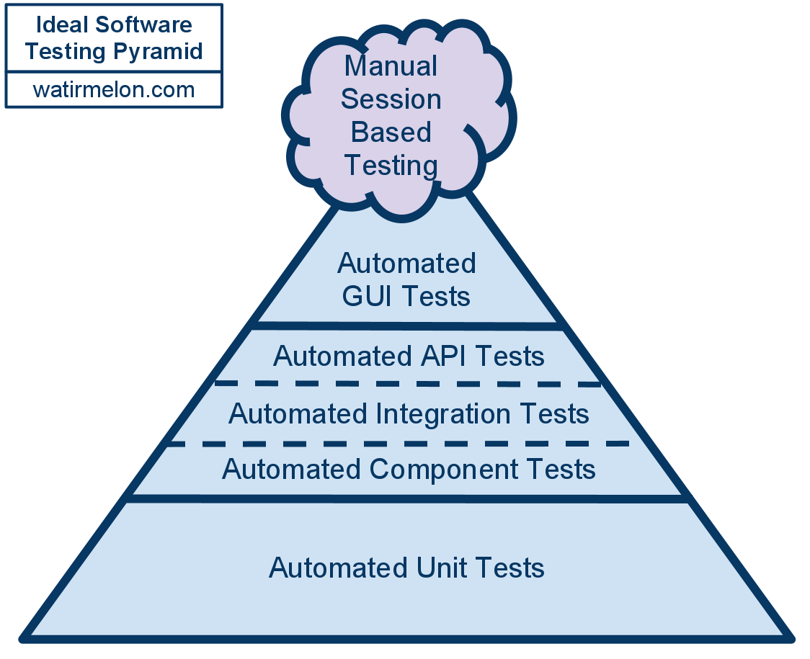

# Testing strategy for Git Phlow
Looking at the structure of Git Phlow, it is relevant to define what is to be considered:
- unit tests (this one is less necessary)
- integration tests
- component tests 
- API tests

As well as whether or not to treat the 'issues' commands as GUI. 

For a normal project, it is worthwhile to take into consideration the testing pyramid: 

For Praqma projects, the "manual" testing is only ever to explore new possibilities for more automated testing, however the rest of the pyramid stands. 

For the sake of this document, integration and component have been switched around, as Git Phlow has defined its integration modules as 'components'. 

Going by the bounded contexts of the Git Phlow command line tool, is worthwhile as this defines what top level modules actually exist. 

## Bounded contexts (API level)
Since there is not yet an architectural overview for git phlow, the propposed bounded contexts are *workon*, *upnext*, *cleanup*, *deliver*, *wraup* and *issues*. 

These points are exellent options for API tests, and would be the only place a system test would make any sense as well. This can be done on an integration test level, keeping it in golang, or from shell/powershell to mimic user interaction. 

Depending on what sort of issues has been seen throughout Git Phlow's life cycle, it is better to keep them in the golang test suite if possible to avoid having to tinker with external dependencies (as powershell/bash requires more maintenance presumably).

Maximum 1-2 tests per bounded context, as anything else is likely too expensive to maintain. 

## Layers (Component level)
Looking at it from a layered approach, these commands go through git, jira and github. For git there is another layer, which is the operating system Git Phlow is running on, while for both github and jira there is authentication. 

The tests here are likely to exercise entire component blocks, wrapping functionality of github, jira and git phlow internals respectively. This will include Windows, Linux and OS X as each of these are perceived as a component black box, and should have black box tests (component tests) covering their happy path, as well as catch OS specific problems. 

Components each are likely to have a varying count of tests, but should have at least one test for each bounded context that calls them. Still only happy path testing should be necessary. 

Pay specific attention to the git component, as tests here might be redundant if all git functions do, is call OS components then it is not worth to put tests here. 

## Low-level building blocks (Integration level)
These are some of what we already test, but should include setting up a repository in git or doing OS-centric calls directly to processes. 
The issue here is that traditionally integration tests either exercise database or network calls, and Git Phlow has a different need. 

Maintaining a repository which can be spun up as code in similar fashion should be a task, similarly to how a testing database spun up as code is the norm. This is the recommended approach we give in our code maturity, and we should heed that here. Here it is probably important to make it external, as otherwise it loses its value by being tied to OS. Note that this solution should be the very last thing we do, as it is extremely high maintenance and quite complex to maintain external test dependencies. (Same as for a database). 

As for network calls, Git Phlow instead has OS calls. Having tests that communicate and do every git command for any of the OS is necessary, and should cover most of the problem. There are also several network calls, which can be modelled as usual. 

For Linux, containerizing and using different linux distros makes it extremely easy to reuse and scale integration tests, as it's possible to rerun the same integration test for different platforms. 
Similarly for OS X. With Windows this is not entirely the same, and different windows slaves may need to be created for the used build system, however when Windows Containers are mature the same can be done here. 

None of the above tests should ever be necessary at the higher levels of testing. Furthermore, testing things that are not happy path may be worthwhile here, depending on where bugs showed up in the past, and future. 

## Methods (Unit test level)
Every method should have a unit test, as it's a straight forward project to run TDD on. However as with most prototypes this is probably not the case, and thus it is necessary to determine which parts of the system are still exploratory. 
Writing a lot of unit tests for existing methods, which are still being restructured is a waste of productivity. 

## Handling "legacy" code
Legacy code for Git Phlow is from here defined as : 

A method, code-block, component or API call not covered by an automated test. 

Allowing legacy code in the CI or CD is perfectly fine, as long as pipeline breaks in the case where someone contributes and lowers code test coverage. Also keep in mind that tests have diminishing returns after 80% coverage (read: not worth doing in most cases). 

